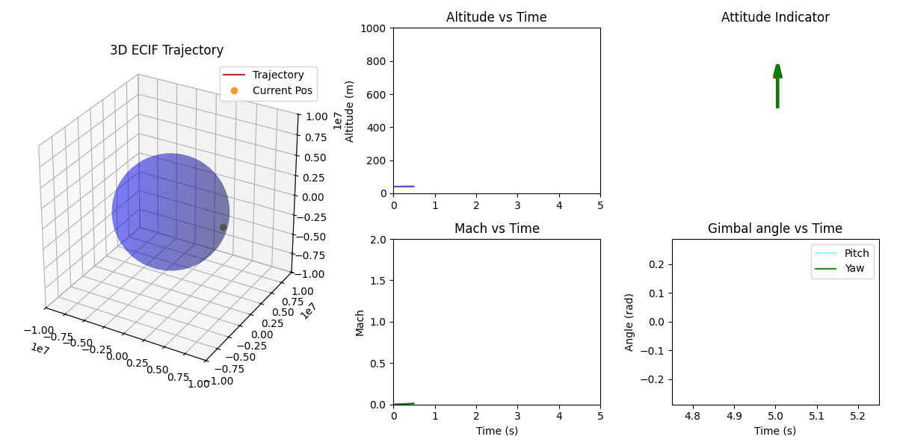

6-DOF Flight Dynamics & Control Simulator
A high-fidelity, 6-Degrees-of-Freedom (6-DOF) launch vehicle simulator written and visualized in Python. This project models the ascent profile of a single-stage rocket, integrating rigid-body rotational kinematics, shifting centers of mass, and active Thrust Vector Control (TVC) to stabilize the vehicle against extreme aerodynamic disturbances. The example given follows data from the Saturn V spacecraft, imagined as a single stage
1. The Core Physics & Mathematical Framework
This simulation does not rely on simplified 2D physics or pre-baked trajectories. Every microsecond of flight is calculated dynamically using a custom physics engine:
  - The Math (RK4 Integration): The core engine solves a 14-variable state vector $\mathbf{Y} = [x, y, z, v_x, v_y, v_z, q_0, q_1, q_2, q_3, \omega_x, \omega_y, \omega_z, m]$ using a 4th-Order Runge-Kutta (RK4) numerical integrator.
  - The Geometry (Quaternions over Euler Angles): Rotational kinematics are handled entirely via quaternions to absolutely eliminate Gimbal Lock during vertical ascent. The Direction Cosine Matrix (DCM) is used to translate forces between the rocket's localized Body Frame and the global coordinate system.
  - The Environment: Translational motion is integrated within the Earth-Centered Inertial (ECI) frame. The environment features a radial, altitude-dependent gravity model $$g(h)$$ and a localized atmospheric model to calculate dynamic pressure, local speed of sound, and Mach number. Aerodynamic coefficients ($C_D, C_N$, Center of Pressure) are pulled dynamically via 2D Bilinear Interpolation from Saturn V wind-tunnel lookup tables.
  
2. Visual Proof of Control: Significant Wind Shear Event

The Edge Case: A physics engine is only as good as its control system. The telemetry dashboard above demonstrates the flight computer actively fighting a chaotic disturbance. Ten seconds after launch, the simulation injects a ~200 m/s lateral wind-shear event (190m/s and -80m/s in the x and y directions respectively).

You can watch the PID controller instantly calculate the pitch/yaw error and command the engine nozzle to gimbal, generating the exact restorative torque needed to prevent the rocket from tumbling and keep the ascent vector perfectly radial to the Earth.

3. Interpretation and Usage
The Python-based Mission Control dashboard reads the telemetry data and provides real-time situational awareness of the vehicle:

-Left Panel (3D Trajectory): Displays the Earth (scaled as an oblate spheroid) and the ECI trajectory of the vehicle.

-Middle (Kinematics): Live readouts of True Altitude (Top) and Mach Number (Bottom).

-Top Right (Attitude Indicator): A localized ENU (East-North-Up) frame showing exactly how the nose of the rocket is oriented relative to "straight up."

-Bottom Right (TVC Gimbal Angle): A live plot of the engine's pitch and yaw gimbal angles. Spikes in this graph indicate the PID controller actively fighting aerodynamic flipping torques.

